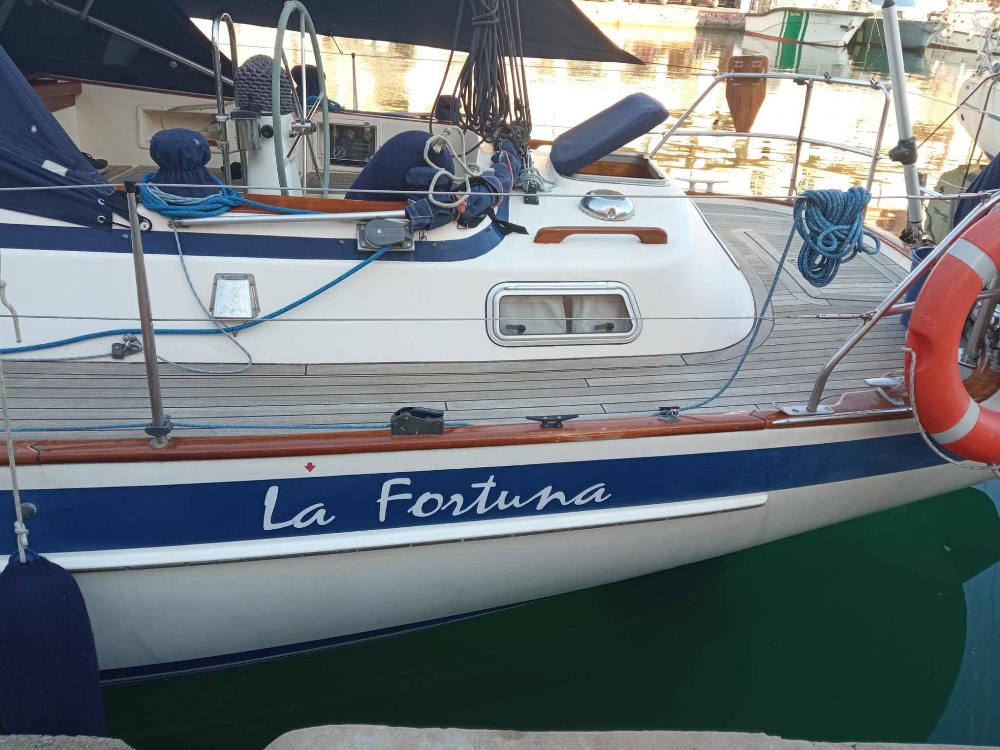

# La Fortuna - Hallberg Rassy 36 MKII

Under construction

## Annual Maintenance

### Routing checks

| Item | Description |
| --- | ----------- |
| Lifejackets | |
| EPIRB | EPIRB and batteries |
| Flares | Replace if required |
| First aid kit | Replace expired items |
| Extinguisher | Take to service / Replace if required |
| Life raft | Annual service  |
| Grab Bag | Replace batteries and expired items |
| VHF Radio | Replace batteries if required |

### External

| Item | Description |
| --- | ----------- |
| Bow Truster | [Electrical checks and anodes](jobs/service-bow-thruster.md) |
| Windlass | Clean, Grease (Marine Lithium White) and check for corrosion and replace (pages.15-20)|
| Hull anodes | Check and replace if necessary |
| Engine service |  |
| Roller Furlex 300S  | Pg.21,22,43,44,46,47,48 |
| Anchor chain | Check chain, and clean w/fresh water |
| MaxProp propeller | Clean, Grease & replace anodes |
| Shaft | Clean and replace anodes |

### Interior

| Item | Description |
| --- | ----------- |
| Shower pump | Clean filter, check/grease impeller |

### Just after splash and leaving yard dock

| Item | Description |
| --- | ----------- |
| Seacocks | Test valve and check for leaks |
| Stern gland | Grease and vent  |

## Maintenance jobs and repairs

- [Service Bow-Thruster](jobs/service-bow-thruster.md)
- [Replace broken bolt from quadrant](jobs/quadrant-auto-pilot.md)
- [Replace anodes](job/replace-anodes.md)

## Projects

- [Rudder seals and bearings replacement](projects/rudder-bearings-seals-replacement.md)
- [Seacock replacement](projects/seacock-replacement.md)
