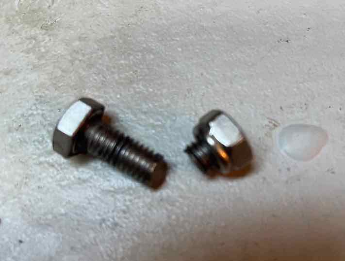

# Replace broken bolt from quadrant

The quadrant has a piece of metal attached to it where the autopilot ram is attached to. This piece of metal is attached to the quadrant with 3 bolts of
7mm and 30mm long (304 stainless steal) with a locking washer and nut. In the photo below you can see the missing bolt.

Every time I return from a passage and before I go home, I check engine, rudder post and thru-hulls. I did not see anything odd.

However, when I returned to the boat this week I found a loose bolt next to the rudder post.

Maybe the bolt broke while sailing but it was stuck in a position where i could not see it. The fact of the matter is that when I returned to the boat 3 weeks later, I saw bolt at the front of the rudder post. And the nut was still sitting in its position.

**Why did it break?**
- I noticed a shiny inner surface where the bolt goes thru which could mean that the
bolt was loose and grinding the surface... maybe
- It was too old. One of the three bolts is longer than the other. Definitely someone changed it. La Fortuna is from 1995, so it has over 28 years old.

**Conclusion**:
- Have 3 spare bolts with its nuts because they will break. 

**More about spares in the steering system**:
- Have a spare wire (purchased from HR Parts)
- Have a spare chain. HR recommends to have one. Necessity (a HR39) broke its steering chain while sailing around the world. I take his lesson.
