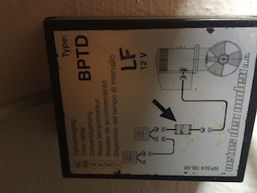

# Service Bow Truster Vetus BOW9512D

## Vetus 185mm 95 kgf

Propeller: Synthetic to avoid corrosion
Power: 5,7 kW
Current consumption: 650 A
Max continuous usage time: 3 minutes
Gear Grease: 0,03 liters outboard gear oil SAE80W-90 o EP 90
Fuse: ‘ATO’ 5 A

## Installation

[Installation Guide](https://vetus.com/cms/wp-content/uploads/020526.08-r02-2019-12-BOW95D.pdf)

- Main switch must be connected to the positive cable.
- A fuse must be included in the ‘positive cable’ for the main switch, as close to the battery as possible.

## Annual service

[Maintenance Guide](https://vetus.com/cms/wp-content/uploads/020901.02-r02_-2021-06-Maintenance-and-Warranty-Manual-for-Thrusters.pdf)

> **IMPORTANT**: Disconnect cables to the battery terminals (first negative, ground) before carrying out maintenance work.

> **IMPORTANT**: Always deactivate the main switch when the bow thruster is not in use for long periods

### Check all electrical connections

Electrical parts (such as bolts and nuts) may come loose as a result of fluctuations in temperature.

1. Open the black box

2. Check battery voltage.

Thruster not operating: 12,6v
Thruster operating: 9,5v (minimum)

2. Check bolts for battery connection. They must be clean and well-tight (9 Nm torque) because thru them goes a lot of amps.

> **IMPORTANT**: Always lock the inner bolt -the one which is close to the body of the bow thruster- with a spanner otherwise you may damage the body

> **NOTE**: There should not be more than 10% voltage drop when activate bow thruster. If it is below 10% you may kill the solenoid inside the bow thruster

Use a clean electrical connections with electronic cleaner (which one?) if they are dirty of rust.

3. Check control cables. Unplug and make sure all the connections are clean.

4. Check the 5A fuse right besides the control cables. This is only for the control. There is another bigger fuse for the power cables close to the main switch.

### Check brushes

Brushes part number: SET0128

After prolonged use, brushes accumulates a thick sticky dust and may stop working.

1. Unscrew the two small bolts on the top of the body and remove the lid.
2. Pull the spring back with some pliers on each brush. There are 4.

  

3. Take brush off (it is still attached to 2 cables)
4. Clean the brushes (1), the holders (2) and the commutator (3). (Blow away
the dust coming off the brushes)
5. Measure the length and ensure all has a minimum length of 16mm
6. Replace the brush if they are smaller.
7. Put the lid back and grease the bolts with Outboard gear grease

> Never spray an anti-corrosion agent into the ventilation openings of the motor or on the contacts of the solenoids switches, this will affect the proper functioning.

### Change propeller anode

Anode part number: SET0150

1. Unscrew two (PH2) screws and the two plastic pieces
  
2. Push the propeller from the other side if we cannot pull it off.
3. The anode is behind the propeller.
4. Unscrew the two (M5) allen bolts.
5. Remove the anode. Ensure it has eaten away.
6. Grease the axes with Outboard Gear Grease.
7. Replace the zinc anode if it is less than half the original size.
8. Screw with 2Nm and apply thread lock (loctite 242)
9. Insert the Propeller
10. Screw (loctite ??)
