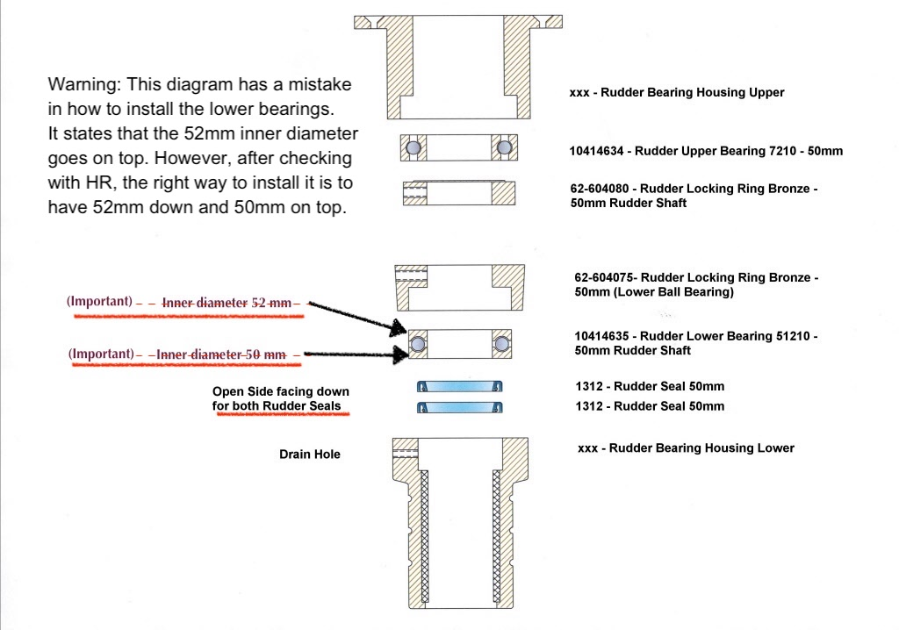

# Rudder bearings and seals replacement

The rudder in our HR 36 is suspended on three bearings from top to bottom:
- upper bearings (within the boat)

- lower bearings (within the boat)


  In between the lower bearing and the hull there is a small bag. Through this
  gap I have noticed a kind of brown-greasy dust and small particles which
  I guess is the result of salt water draining out the grease in the lower bearings
  solidifying over time
  
- skeg bearings (outside the boat)

Here is a sketch diagram of the rudder post, skeg and bearings.


A photos of the location of the bearings


Closer diagram of lower and upper bearings


Rudder Seals


Note: At least this HR 36 MKII has no greasing nipples in any of the bearings. I have read some newer models and probably larger boat lengths do have those nipples.

# Procedure to replace lower & upper bearings and seals

This is without removing the entire rudder and/or the skeg. However, this operation has to be done outside of the water because we have to support the rudder by placing something to hold the lower tip of the rudder.

At this stage, we know the lower seal is compromise because we have seen some brownish water coming out of the drainage tube. This means that, at least, we have to change that seal. We do not if the upper seal is still good and we can keep it or replace it. Also, we do not know if the bearings, lower and/or upper, are affected. Everyone advices to replace them anyway given the hassle of the operation.
In the groups.io/Hallberg-Rassy-Sailing forum some mentions that if the rudder is not stiff, the bearings are still in good shape. In my case, I have noticed the rudder is getting stiffer to turn within a period of 2-3 months of sailing almost uninterruptedly. So, I suspect the bearings are also somewhat affected.


1. Remove the plastic lid on the top end of the rudderstock.


2. Screw  an M10 eyebolt on the rudderstock and attach it to a gantry with a turnbuckle.


3. Also support the rudder from below. **Always keep one support at all times**

4. Unbolt and remove the steering cables, steering quadrant and quadrant key. You may need to grip the key firmly with locking pliers and hit the locking pliers with a hammer to get it loose.


5. Unbolt and remove the autopilot-drive arm.

6. Mark the position and release the Rudder Locking Ring, allowing both the Rudder Locking Ring and Rudder Upper Bearing, to be lowered. Note that the bolts have hex heads — the nuts are a locking mechanism.

7. Mark the radial position, unbolt and remove the Rudder Bearing Housing Upper. Remove both Rudder Upper Bearing and Rudder Locking Ring Bronze.


8. Mark the position of the lower locking ring and release it. This ring holds
the rudder in the right position.


9. Gently lower the rudder (maximum.15mm) using the turnbuckle, resting it on Rudder Skeg Bearing and also support the rudder against the ground (as already mention in above position No. 3).

If the second seal has failed and water has entered the lower bearing, the lower bearing will corrode, binding to the lower locking ring and the rudderstock. Applying lubrication to the shaft or heating the ring with a propane torch may be necessary to break it free.

10. Slide the lock ring up on the shaft. Then lift the ball bearing. (On some boats this bearing is a Delrin plate (White plastic material). Underneath you will see the two seals.

Pull out the old simmer seals. If difficult, screwing down a few screws into the old seals to help pull up, especially the lower one, can help.

11. Replace the seals with the new ones. (Note the direction on the seals). Be very careful when you are sliding the new seals on to the shaft. Grades on the shaft will (most likely where the tiller arms where fitted) damage the seals. Use a protective paper between the seal and shaft.

 New Rudder Seals can be installed in a few different ways. But always with great care. Slots in the Rudder Shaft for Steering Gear Key and Autopilot Key can have sharp edges and damage the new Rudder Seals in the process. Clean the Rudder Shaft. Check the Rudder Shaft for any sharp edges. Wrap a paper tight around the top of the Rudder Shaft. Pull both new (1041466) Rudder Seals over the paper, and then move the paper down on the Rudder Shaft with the new (1041466) Rudder Seals.

Please Note : Both seals must be fitted in the same direction, flat side facing up, open side facing down. Make sure Rudder Seals are well greased when installed. Also grease both Rudder Upper Bearing and Rudder Lower Bearing 51215 well when re-installing. **Which grease type?**

From [groups.io](https://groups.io/g/Hallberg-Rassy-Sailing/message/18437)
```
Removing and replacing the lip seals was the trickiest part and I did use screws to remove and replace using the paper method with grease making sure the seals were not scored / damaged in anyway. This is very important as if not done correctly you will have a small leak.
```

12. Make sure the Drain Hole (Leakage indicator hole) is clean and that one Seal ring is positioned below the drain hole and one Seal Ring is positioned above the drain hole.

13. Then reassemble the rudder in the opposite order. Do not forget to lift up the rudder before you lock it in position with the brass ring.


# Replace skeg bearing

From: https://groups.io/g/Hallberg-Rassy-Sailing/message/12620
```
1. Old skeg bearing before dismounting, after paint stripping. New bearing from HR parts with tube and elbow for epoxy filling of gap between new bearing and fiberglass skeg.


2. Old skeg bearing removed, threaded rod and wood gantry to drop rudder

3. Old middle bearing before removal, empty tube, holding in new bearing rollers with balloon, and finished installation.
I got the balloon idea from someone on this group. Brilliant, thank you!

4. Rudder almost dropped: Either dig hole or have crane operators lift boat.
New bearing installed (check for alignment and play!), plug screw holes and top edge with resin filler (leave bleed hole!) and fill with epoxy resin through tubes. Then patch, sand, and paint new bearing.
```

From [Rusalka HR40](https://groups.io/g/Hallberg-Rassy-Sailing/message/12624)
```
I can add that the bronze skeg bearing has 2 large holes, one either side near the top. These are used, after it is fitted into place, to pour in resin to fill any voids between the bronze and the skeg. The "kit' is supplied with tubes that screw into those holes to enable the pouring. The voids may be created when fitting the new skeg bearing. This information is "theoretical" from me, it is what I was told by HR-Parts.
```
