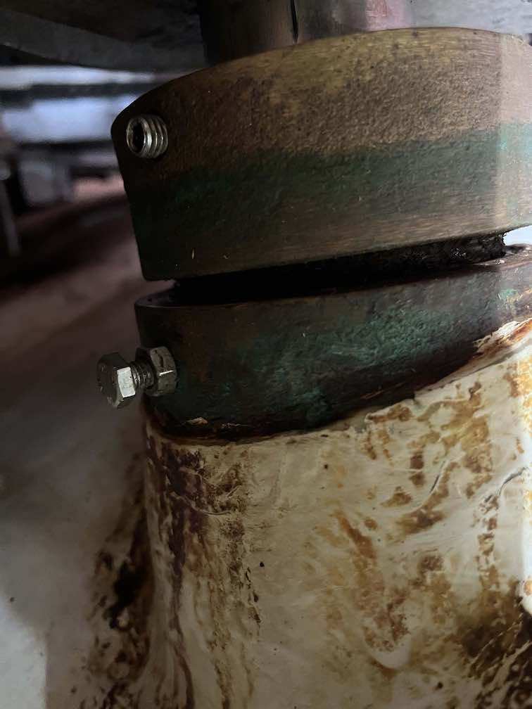

# Rudder bearings and seals replacement

The rudder in our HR 36 is suspended on three bearings from top to bottom:
- upper bearings (within the boat)

- lower bearings (within the boat)

  In between the lower bearing and the thru-hull bearing housing there is a small gap. Through this gap, I have noticed a kind of brown-greasy dust and small particles which
  I guess is the result of salt water draining out the grease in the lower bearings
  solidifying over time.

  In the last photo above, one can see a screw in the lower bearing house. This is the wheeping hole which is closed with a screw because the first seal is now compromised and water comes. We should not have any screw in the wheeping hole unless we start to see
  water coming out.

- Skeg bearings (outside the boat)

Here is a sketch diagram of the rudder post, skeg and bearings:

Location of the bearings:

Closer diagram of lower and upper bearings:

Rudder Seals:

# Procedure to replace lower & upper bearings and seals

This is without removing the entire rudder and/or the skeg. However, this operation has to be done outside of the water because we have to support the rudder by placing something to hold the lower tip of the rudder.

At this stage, we know the lower seal is compromised because we have seen some brownish water coming out of the drainage tube. This means that, at least, we have to change that seal. At this stage, we are better of replacing the two seals, not just one. We do not know if the bearings, lower and/or upper, are affected. Everyone advices to replace them anyway given the hassle of the operation.
In the groups.io/Hallberg-Rassy-Sailing forum someone mentions that if the rudder is not stiff, the bearings are still in good shape. In my case, I have noticed the rudder is getting stiffer. So, I suspect the bearings are also somewhat affected.

The credits for the steps enumerated below goes to Hallberg Rassy and to several people in groups.io/Hallberg-Rassy-Sailing forum who have contributed their experiences in particular Dennis Patti from s/v Endeavour HR36:

1. Remove the plastic lid on the top end of the rudder stock.

2. Secure the rudder stock by screwing an M10 eyebolt on the rudder stock and attach it to a gantry with a turnbuckle.

3. Also support the rudder from below. **Always keep one support at all times**. For instance, if you have access to a car jack or a small hydraulic jack the better.
**The most important thing to do before you do anything else, is to secure the rudder from falling down**

4. Unbolt and remove the steering cables, steering quadrant and quadrant key. You may need to grip the key firmly with locking pliers and hit the locking pliers with a hammer to get it loose.

If it gets too difficult to remove the key from the rudder post, some boat owners
have removed it using a self designed pully puller.
> Drilled 2 M8 holes in the key (first M6, but they were pulled out) and used M8x15cm. That worked. The key turned out to measure 16mm and the slot is 15.45mm. That explains the force used to get it in and the troubles to get is out.
Onwards to the next step.

> Maybe it is a good time to remove the cables, inspect and grease them.

5. Unbolt and remove the autopilot-drive arm.

6. Mark the position and release the Upper Rudder Locking Ring, allowing both the Upper Rudder Locking Ring and Rudder Upper Bearing, to be lowered. Note that the bolts have hex heads — the nuts are a locking mechanism.

  > How to Mark the position? Maybe by placing a tape in the rudder stock right below the Locking ring

7. Mark the radial position, unbolt and remove the Rudder Bearing Housing Upper. Remove both Rudder Upper Bearing and Rudder Locking Ring Bronze.

8. Mark the position of the lower locking ring and release it. This ring holds
the rudder in the right position.

9. Gently lower the rudder (maximum 15mm) using the turnbuckle, resting it on Rudder Skeg Bearing and also support the rudder against the ground (as already mention in above position No. 3).

If the second seal has failed and water has entered the lower bearing, the lower bearing will corrode, binding to the lower locking ring and the rudder stock. Applying lubrication to the shaft or heating the ring with a propane torch may be necessary to break it free.

10. Undo the lifting gear or gantry. Slide the lock ring up on the shaft. Then lift the ball bearing. (On some boats this bearing is a Delrin plate (White plastic material). Underneath you will see the two seals.

Pull out the old simmer seals. If difficult, screwing down a few screws into the old seals to help pull up, especially the lower one, can help. If you find it hard to remove the seals, try to use a [seal puller](https://youtu.be/TYkZlKYSz4Q) instead.

11. Replace the seals with the new ones. (Note the direction on the seals). Be very careful when you are sliding the new seals on to the shaft. Grades on the shaft will (most likely where the tiller arms where fitted) damage the seals. Use a protective paper between the seal and shaft.

 New Rudder Seals can be installed in a few different ways. But always with great care. Slots in the Rudder Shaft for Steering Gear Key and Autopilot Key can have sharp edges and damage the new Rudder Seals in the process. Clean the Rudder Shaft. Check the Rudder Shaft for any sharp edges. Wrap a paper tight around the top of the Rudder Shaft. Pull both new (1041466) Rudder Seals over the paper, and then move the paper down on the Rudder Shaft with the new (1041466) Rudder Seals.

Please Note : Both seals must be fitted in the same direction, flat side facing up, open side facing down. Make sure Rudder Seals are well greased when installed. Also grease both Rudder Upper Bearing and Rudder Lower Bearing 51215 well when re-installing.

Recommended grease by HR is [SuperLube](https://shop.hallberg-rassy.com/contents/en-us/p3413_SuperLube-Tube-85g.html).

From [groups.io](https://groups.io/g/Hallberg-Rassy-Sailing/message/18437)

> Removing and replacing the lip seals was the trickiest part and I did use screws to remove and replace using the paper method with grease making sure the seals were not scored / damaged in anyway. This is very important as if not done correctly you will have a small leak.

12. Make sure the Drain Hole (Leakage indicator hole) is clean and that one Seal ring is positioned below the drain hole and one Seal Ring is positioned above the drain hole.

13. Then reassemble the rudder in the opposite order. Do not forget to lift up the rudder before you lock it in position with the brass ring.

# Replace skeg bearing

From: https://groups.io/g/Hallberg-Rassy-Sailing/message/12620

> 1. Old skeg bearing before dismounting, after paint stripping. New bearing from HR parts with tube and elbow for epoxy filling of gap between new bearing and fiberglass skeg.

> 2. Old skeg bearing removed, threaded rod and wood gantry to drop rudder

> 3. Old middle bearing before removal, empty tube, holding in new bearing rollers with balloon, and finished installation.
I got the balloon idea from someone on this group. Brilliant, thank you!

> 4. Rudder almost dropped: Either dig hole or have crane operators lift boat.
New bearing installed (check for alignment and play!), plug screw holes and top edge with resin filler (leave bleed hole!) and fill with epoxy resin through tubes. Then patch, sand, and paint new bearing.

From [Rusalka HR40](https://groups.io/g/Hallberg-Rassy-Sailing/message/12624)

> I can add that the bronze skeg bearing has 2 large holes, one either side near the top. These are used, after it is fitted into place, to pour in resin to fill any voids between the bronze and the skeg. The "kit' is supplied with tubes that screw into those holes to enable the pouring. The voids may be created when fitting the new skeg bearing. This information is "theoretical" from me, it is what I was told by HR-Parts.

From [Cayuga II - HR34](https://groups.io/g/Hallberg-Rassy-Sailing/message/12619)

> The skeg bearing is the third (lowest) bearing on the rudder shaft ; its purpose is to take some of the efforts on the the 2 main self aligning bearing , particularly in rough seas .(typical of the "strong boat" philosophy of HR ) .
It is made of bronze , in 2 parts and clamps around the stainless steel shaft .

> Being in bronze , it does wear against the stainless steel and I have noticed on many HR on the hard that some play exists in this bearing ; on my HR 34 it happened after 8 years ; sometimes much earlier . This is normal and no cause for immediate concern but has to be addressed .

>The replacement of the bronze bearing is fairly simple : the part is available from HR parts and machined exactly to the shaft diameter :
- dismantle the old bearing : separate the 2 halves and unscrew the part attached to the keel ( often the bolts are a bit covered with putty which is easy to remove )
- replace by the new bearing requires to be a bit cautious : as engineers know , a 3 bearings alignment is a little tricky to realize ; the procedure to follow is -- screw  in the bolts into the keel WITHOUT TIGHTENING them -- screw the other half tightly around the shaft -- and only then tighten the bolts into the keel . In doing so , you are sure not to damage the main bearings by a faulty alignment .
Note : it can happen that initially the rudder feels a bit hard : no worry :  either it will wear quickly or you can untie a little the bolts joining the 2 halves .

> In their recent  design , HR equips the bearing with 1 or 2 greasing nipples (in my case there was no nipple and I had to add one by drilling a hole into which the nipple can be screwed ) ; before going back into the water push as much grease as possible into the bearing ( overflowing ) . Note that the role of the grease is not lubrication ( bronze against stainless steel is self lubricating ) but to  avoid water ingress inside the bearing which accelerates the wear , particularly if water is loaded with silt or sand .
