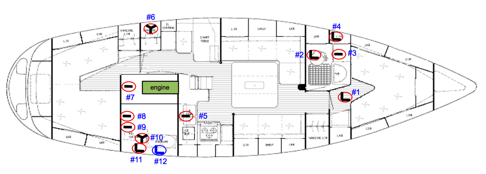

# Seacocks replacement with TruDesign

It is now 9 months since I bought **La Fortuna** and although most of the thru-hulls look good on the outside, there are at least 3 which must be replaced. The valve open and close without any issues but they do not look good.

I have never done this job before so this document is the result of gathering as much information about the task, the tools and the materials. Thanks everyone from the [HallbergRassy facebook group](https://www.facebook.com/groups/Hallberg.Rassy.Club) that answered all my questions and shared their experiences.

**NOTE: THIS DOCUMENT IS STILL IN PROGRESS UNTIL I FULLY REPLACE THE OLD SEACOCKS AND UPDATE THIS DOCUMENT WITH THE EXPERIENCE, ADDITIONAL PHOTOS, ETC.**

## Seacock distribution

This is the current distribution of seacocks on my HR 36 with the thru-hull sizes. Each circle represents a seacock, and the shape within the circle represents the type of skin-fitting, which can be *straight*, or *90% L shape*. The *Y shape* means that right after the valve there is a *Y hole tails*. The thru-hull in those Y seacocks are really 90 degree fitting connected to a valve and then a Y hole tail.

| Seacock | Description | Current size | New size   | Long skin-fitting ? |
| --- | ----------- | ---- |----| --- |
| 1 | Water intake toilet | 90degree 1/2'' | 3/4 '' |  required |
| 2 | Outlet toilet | 90degree 1/4'' | 1 1/4'' |  |
| 3 | Outlet wash basin | straight 3/4'' | 3/4 '' |  |
| 4 | Outlet shower  | 90degree 1/2'' | 3/4 '' |  |
| 5 | Outlet galley sink  | straight 1 1/4'' | 1 1/4 '' |  |
| 6 | Port deck drain | 90degree+Y 1 1/4'' | 1 1/4 '' |  |
| 7 | Seawater intake engine | straight 1 1/4'' | 1 1/4 '' | required |
| 8 | Cockpit drain | straight 1 1/4'' | 1 1/4 '' |  required |
| 9 | Cockpit drain | straight 1 1/4'' | 1 1/4 '' |  required |
| 10 | Starboard deck drain | 90degree+Y 1 1/4'' | 1 1/4 '' |  |
| 11 | Gas box drain | 90degree 1 1/4'' | 1 1/4 '' |  |
| 12 | Outlet bilge pump | 90degree 3/4'' | 3/4 '' |  |

> 11 and 12 are above water line.

> I am still unsure where I need to install long skin-fittings rather than standard ones.

## Required Tools

- Heat gun - useful to remove pipes which are glued to the hose tails
- Pipe wrench
- Hack saw - useful to cut the flange from old seacock or just to make the hole wider
- Step drill - to remove the old seacock by grinding it off

## Parts to purchase

- skin-fittings standard size and long size
- valve of various sizes
- hose tail
- innox clamps (should we had to replace old ones)

## Existing parts

- backing plates
- pipes

## Procedure

### 1. Remove old through-hull

Remove the hose clamps and the hose from the valve or hose tails. If it is too hard, I use a heat gun.

If I want to replace the old through-hull with a new one with the same diameter/size then I follow the instructions in the next section, 1.a. In the contrary, if I want to use a bigger through-hull, I need to make a wider hole and I follow the instructions on the following section, 1.b.

### 1.a. Use same hole for new through-hull

Use a step drill from outside of the boat to remove the flange. It also heats up the through-hull a little bit which softens the original sealant.
> Thanks Juha for sharing [this video](https://www.facebook.com/reel/876448336934711)

Once the flange is gone and also part of the through-hull, go inside the boat and with bare hands, rotate the valve+through-hull combo to remove it entirely.

There is another technique which consist in using a hole saw slightly larger (2-3 mm) than the through-hull inner diameter and smaller than the flange. And cut off the flange from the through-hull.
Here is [a video](https://youtu.be/Tysi4ScnZ_w), from SY Fryd, that shows how it is done.

### 1.b. Make wider hole for new through-hull

To remove the old through-hull and make the hole bigger there are two techniques:
- Use a wood bung and a hole saw with the outer diameter of the new through-hull. This technique is explained by [TruDesign](https://trudesignplastics-com.s3.amazonaws.com/questions/documents/12/0fab29c9f7d8654c8189eac3a69e139b.pdf).  
- Use two hole saw. One with the outer diameter of the new through-hull and another one of the same diameter of the inner diameter of the old through-hull which serves a guide.

### 2. Prepare hole for the new thru-hull

Sand the hull surface around the hole to remove all antifouling paint using 80 grit sand paper. This is to achieve better bonding between hull and the flange of the new thru-hull with the sealant.

Sand also inside the boat.

Sand the hole's walls to remove any sealant. If it is too difficult to remove it, we use a small grinder to carefully remove the sealant.

Ensure the hole is absolutely dry without any humidity. Also ensure the backing plate is dry without any humidity.

Apply a coat of epoxy resin (without filler) around and inside the hole to ensure the fiberglass or inner core does not get absorb any water/humidity. Also around the hull surface where it will sit the skin-fitting's flange.

Sand the epoxy surface to improve bonding and clean with acetone.

### 3. Fit dry the thru-hull

**Which skin-fitting shall I use?** *standard* or *long size*?

The [Standard skin fitting domed](https://www.trudesign.nz/marine/products/20-skin-fittings-domed) is 66mm long and the [long skin fitting domed](https://www.trudesign.nz/marine/products/81-skin-fittings-long-domed) is 140mm long but requires a minimum hull thickness of 33mm.
Once I remove my old THs, I will know exactly how think the hull is but I am gathering from other HR owners that our hulls are rather thick, in between 40mm and 50mm. So, long skin fitting seems appropriate.

1. Insert the thru-hull and hold it with some tape so that you can go inside the boat
2. Go inside and insert the washer, the nut and valve onto the thru-hull
3. Measure how much to cut the thru-hull: Distance between nut the valve
4. Cut the excess with a hack saw. Insert the nut before cutting so that it helps us later to redo any bits of the thread damaged

Now we have the thru-hull of the right length.

### 4. Fit dry the whole seacock

1. Once you have the thru-hull inserted into the hole
2. Go inside of the boat
3. Screw the ring, the nut and value , hand tight, no more
4. Insert the hose connector onto the valve. If possible, without any kind of reductions.
5. Insert the hole
6. Now, with everything in place, ensure I can open and close the valve without any problems
7. Once everything is aligned, I mark the position in the hull with a marker or a blue tape so that I know the position I should tight the valve again

### 5. Fit thru-hull

Note: I have read that it is recommended to sand the thru-hull for better bonding of the sealant/epoxy.

1. Put masking tape on the thread where the valve screws in. This is just in case sealing/epoxy gets there. We should apply some thread sealant to the threads but try to leave 1/4'' without any sealant to avoid any sealant from getting into the valve itself and blocking it.
2. Apply sealant to the inside of the flange and the thread that will stay in between the hull.
3. Insert the thru-hull across the hole in the hull and rotate it to spread the sealant on all the flange's surface and avoid air bubbles. Leave the through-hull right on the mark on the hull we did previously
4. Go inside and fill up any void with more sealant.
5. Insert the washer and nut and hand tight it and leave it until it cures. Clean any excess of sealant.
> Note: It’s important there’s sealant between the hull and washer and between the washer and nut, so to ensure this the nut need only be finger-tight so it doesn’t squeeze all the sealant out, allowing the sealant to do its job.

6. Once it has cured, remove the masking tape on the thread where we are going to screw the valve
7. Tight the nut a bit more (15ft lb). How much is that? Aprox almost half a turn?
8. Apply thread-selant of your preference, e.g. loctite 55, across the threads not following them
9. Screw the valve in and the hose adapter and let it cure before inserting the hoses

Don't you prefer to remove the excess of sealant while fresh rather than cut it away when dry with a knife or cutter?

**Note**:
- Throw away the old hose innox clamps if they have some rust

### 6. Attach the strainer

You can epoxy the [strainer](https://www.trudesign.nz/marine/products/18-intake-strainers) to the hull with a west type system or a strong marine sealant like 3M Fastcure 5200 would also work.

Roughen the hull in the shape of the strainer where it will touch the hull, apply the sealant to the whole underside surface of the strainer. Finally, angle the sealant around the outside shape of the strainer to the hull and this will lock the strainer and stop any movement.
